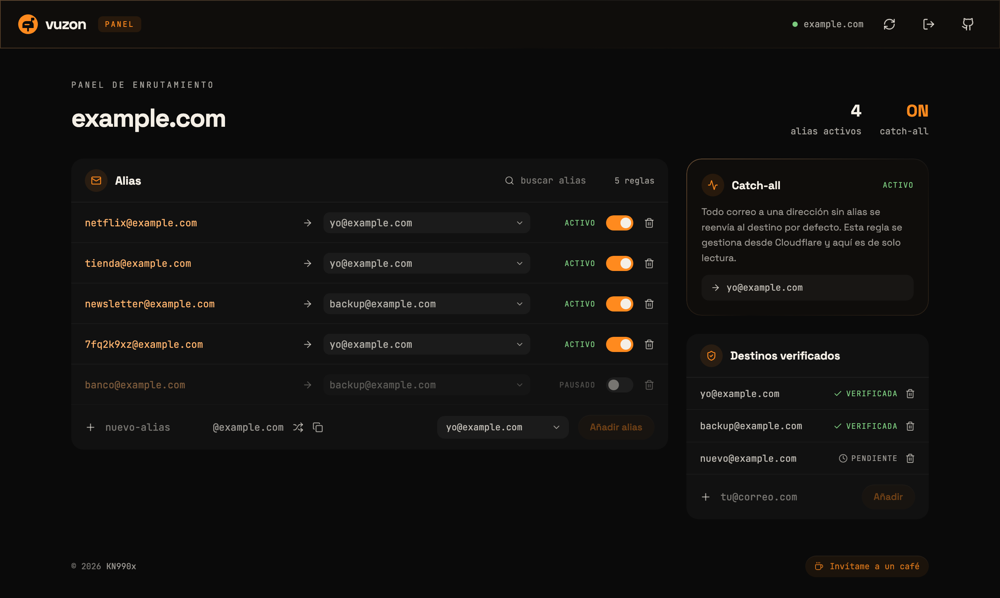

<p align="center">
  
</p>

<div align="center">

<h3>
  <a href="#english">English</a> | <a href="#spanish">Español</a>
</h3>

</div>

<p align="center">
  <a href="https://github.com/KN990x/vuzon/stargazers">
    
  </a>
  &nbsp;
  <a href="https://github.com/KN990x/vuzon/issues">
    
  </a>
  &nbsp;
  <a href="./LICENSE">
    
  </a>
  &nbsp;
  
</p>

<p align="center">
  <a href="https://github.com/KN990x/vuzon/actions/workflows/ci.yml">
    
  </a>
  &nbsp;
  <a href="https://github.com/KN990x/vuzon/releases/latest">
    
  </a>
  &nbsp;
  <a href="https://github.com/KN990x/vuzon/pkgs/container/vuzon">
    
  </a>
  &nbsp;
  
</p>

<p align="center">
  
  &nbsp;
  
  &nbsp;
  
  &nbsp;
  
  &nbsp;
  
</p>

<p align="center">
  
</p>

<a id="english"></a>

# vuzon

**vuzon** is a lightweight web UI to manage **aliases and rules** for [Cloudflare Email Routing](https://developers.cloudflare.com/email-routing/) and **destination addresses**. It is meant for **personal use** with your Cloudflare account on a **homelab or private network**, not as a public multi-tenant or “production SaaS” deployment.

Give every service its own address (`netflix@yourdomain.com`, `shop@yourdomain.com`), see at a glance which ones are active, and **pause or delete the one that starts getting spam** — without digging through the Cloudflare dashboard.

---

## Features

**Aliases**

- **Create, pause, and delete** aliases on your domain — a pause keeps the rule but stops delivery.
- **Change an alias's destination** without deleting and recreating it.
- **Random alias generator** (8 characters, `crypto.getRandomValues` — never `Math.random`, since a guessable alias defeats the point).
- **One-click copy** of the address you are about to create.
- **Search** to filter aliases as the list grows.

**Destination addresses**

- Add and remove destinations, with **verified / pending** status always visible.
- Only **verified** destinations can be picked for an alias — the server enforces it, not just the UI.

**Catch-all**

- Shown **read-only**. The API refuses to modify or delete it, so you cannot break your fallback rule by accident from the panel.

**Interface**

- **English and Spanish**, switched from the globe in the header. English is the default; your choice is remembered in the browser.
- Error messages are localised too: the API answers with a machine-readable code and the panel writes the sentence in your language.

**Operations**

- **Single Docker image**, multi-arch **amd64 / arm64**, published to GHCR on every release.
- **No database, nothing on disk** — the session lives in a signed cookie.
- **Plain HTTP keeps working** for a homelab LAN; TLS-specific hardening (`COOKIE_SECURE`, HSTS) is opt-in.
- **Zone/account autodetection** from `DOMAIN`, so there are usually only four variables to set.
- Refuses to start with an obviously unsafe config (empty or template `SESSION_SECRET`, missing credentials) instead of coming up in a broken state.

> Everything runs against **your** Cloudflare account with **your** API token. vuzon has no backend of its own, no telemetry, and no third-party services.

> **Heads-up:** the screenshot above shows the Spanish interface. The panel opens in **English** by default — use the globe in the header to switch.

---

## Installation

### Docker Compose

**Quick install** (files from the [`main`](https://github.com/KN990x/vuzon/tree/main) branch):

```bash
mkdir vuzon && cd vuzon
curl -fsSL -O https://raw.githubusercontent.com/KN990x/vuzon/main/docker-compose.yml \
  -O https://raw.githubusercontent.com/KN990x/vuzon/main/.env.example
cp .env.example .env

# Print a session signing key to paste into SESSION_SECRET
openssl rand -hex 32

# Fill in DOMAIN, AUTH_USER, AUTH_PASS, CF_API_TOKEN and SESSION_SECRET
"${EDITOR:-nano}" .env

docker compose pull && docker compose up -d
```

**`.env` ships with empty values on purpose** — vuzon **will not start** until you fill them in. That is deliberate: a template secret published in a public repo is a secret everyone knows, and the session cookie is *signed* with it, so a known `SESSION_SECRET` would let anyone forge a logged-in session. Startup rejects the template values outright rather than booting with them.

**Manual:** put [`docker-compose.yml`](docker-compose.yml) and [`.env.example`](.env.example) in the same directory (from the repo, e.g. [raw `docker-compose.yml`](https://raw.githubusercontent.com/KN990x/vuzon/main/docker-compose.yml) and [raw `.env.example`](https://raw.githubusercontent.com/KN990x/vuzon/main/.env.example)), run **`cp .env.example .env`**, edit **`.env`**, then **`docker compose pull && docker compose up -d`**.

Open **http://localhost:8001** (or `http://<server-ip>:<port>` on your LAN). Another host port: **`VUZON_PORT`** in `.env`.

Problems: **`docker compose logs -f vuzon`** — startup errors name the exact variable to fix.

Login uses a signed **`vuzon_session`** cookie only (nothing on disk). For local image builds, pinning, and HTTP details, see **[CONTRIBUTING.md](CONTRIBUTING.md)**.

### Updating

```bash
docker compose pull && docker compose up -d
```

The image is rebuilt and published to GHCR on every release. Your `.env` is untouched; sessions survive the restart.

---

## Requirements

- **Docker** and **Docker Compose**
- A **Cloudflare** zone (domain) with **Email Routing** enabled for that zone.
- A Cloudflare **API token** with the permissions below (see **[Cloudflare API token](#cloudflare-api-token)**). Official guide: [Create API tokens](https://developers.cloudflare.com/fundamentals/api/get-started/create-token/).

### Cloudflare API token

1. Open the Cloudflare dashboard → **My Profile** (avatar, top right) → **[API Tokens](https://dash.cloudflare.com/profile/api-tokens)**.
2. Click **Create Token** → **Create Custom Token**.
3. Under **Permissions**, add these rows (names match the English Cloudflare UI):

   | Scope | Permission | Why vuzon needs it |
   |-------|------------|-------------------|
   | **Account** → **Email Routing Addresses** | **Edit** | List, add, and remove destination addresses (`/accounts/.../email/routing/addresses`). |
   | **Zone** → **Email Routing Rules** | **Edit** | List, create, update, enable/disable, and delete routing rules (`/zones/.../email/routing/rules`). |
   | **Zone** → **Zone** | **Read** | On startup, resolve **`CF_ZONE_ID`** and **`CF_ACCOUNT_ID`** from **`DOMAIN`** via `GET /zones?name=...`. Skip this row only if you set both IDs manually in `.env`. |

4. Under **Account Resources**, choose the account that owns the zone (or **All accounts** if you accept broader access).
5. Under **Zone Resources**, restrict to **Specific zone** → your domain (recommended), or **All zones** for that account.
6. Create the token and copy the value into **`CF_API_TOKEN`** in `.env` (Cloudflare shows it **once**).

Use an **API token**, not the **Global API Key**. Prefer **least privilege** (one zone, one account) over “all zones” when possible.

---

## Environment variables

If **`.env`** exists next to `docker-compose.yml`, Compose passes it into the container (`env_file` with `required: false` on Compose **v2.24+**). Without a populated `.env`, the container may start but the process exits until **`CF_API_TOKEN`**, **`DOMAIN`**, **`AUTH_USER`**, **`AUTH_PASS`**, and (in the Docker image) **`SESSION_SECRET`** are set.

### Quick reference

Minimum: **`CF_API_TOKEN`**, **`DOMAIN`**, **`AUTH_USER`**, **`AUTH_PASS`**. With the published Docker image (`NODE_ENV=production`), also set **`SESSION_SECRET`**. **`VUZON_PORT`** changes the **host** port (default **8001**); inside the container Compose sets **`PORT=8001`** — you usually omit **`PORT`** in `.env` for Docker.

| Variable | Purpose |
|----------|---------|
| **`CF_API_TOKEN`** | Cloudflare API token (Email Routing; see **Requirements**). |
| **`DOMAIN`** | Zone apex in Cloudflare; used to resolve zone/account if IDs are not set. |
| **`AUTH_USER`** / **`AUTH_PASS`** | Panel login (password must be non-empty). |
| **`VUZON_PORT`** | Host TCP port mapped to the app (default **8001**). |
| **`SESSION_SECRET`** | Signs **`vuzon_session`**. **Required** when **`NODE_ENV=production`** (Docker image); **minimum 32 characters** — generate it with `openssl rand -hex 32`. The template value from `.env.example` is **rejected at startup**, as is anything with almost no variety of characters. In local development, if missing, an ephemeral secret is generated and **sessions reset on restart**. |
| **`COOKIE_SECURE`** | Set to **`1`** so the session cookie is marked **`Secure`** (HTTPS / TLS-terminating proxy). **Off by default** so homelab HTTP (`http://localhost` / LAN IP) works. |

**If autodetection from `DOMAIN` fails:** set both **`CF_ZONE_ID`** and **`CF_ACCOUNT_ID`** in `.env`. Autodetection also stops if two zones share the same name — the startup error says so.

**Behind a reverse proxy (nginx, Traefik, etc.):** set **`TRUST_PROXY`** so Express trusts `X-Forwarded-*`, sees the real client IP, and login rate limiting works correctly. Accepted values: a **hop count** (`1`, `2`, …), one of **`loopback`** / **`linklocal`** / **`uniquelocal`**, or an **IP/CIDR list** (`10.0.0.0/8`, `127.0.0.1, 192.168.1.0/24`). An unrecognised value leaves it **off** and logs a warning at startup. With TLS termination, also set **`COOKIE_SECURE=1`**. **Both off by default.**

**Local `pnpm start`:** **`PORT`** overrides **`VUZON_PORT`** for the listen port. The Docker image sets **`NODE_ENV=production`** (requires **`SESSION_SECRET`**); cookies stay usable over HTTP unless you set **`COOKIE_SECURE=1`**.

Other developer-oriented variables (`VUZON_PUBLIC_DIR`): **[CONTRIBUTING.md](CONTRIBUTING.md)**.

---

## Basic usage

1. **Enable Email Routing** on the zone (Cloudflare dashboard).
2. Add a **destination address** (a verification email is sent). It stays **Pending** until you click the link in that email.
3. Sign in to vuzon and create an **alias (rule)** with a lowercase local part and a **verified** destination — or hit the shuffle icon for a random one.
4. Later: **switch its destination** from the dropdown on the alias row, **pause** it with the toggle, or delete it.

Aliases that run an Email Worker, drop mail, or forward to several addresses show as read-only text — vuzon will not overwrite routing you configured outside the panel.

---

## Security

**What you should do**

- Prefer **API tokens** with **least privilege** (one zone, one account), not the Global API Key.
- Use a strong **`AUTH_PASS`** and a `SESSION_SECRET` from `openssl rand -hex 32`.
- If the panel is reachable from the internet, use **TLS** (reverse proxy), set **`COOKIE_SECURE=1`**, and sound network hygiene.

**What vuzon does**

- **Refuses to start** with missing credentials or a template/low-entropy `SESSION_SECRET`.
- Panel credentials are compared in **constant time**; login is rate-limited to **10 attempts / 15 min**.
- **Logging out invalidates the cookie**, not just the browser copy — a cookie captured earlier stops working.
- Cloudflare's error text is **logged server-side and never returned to the browser**; upstream 401/403 are normalised to 502 so they can't be mistaken for your own session expiring.
- Strict **CSP**, `nosniff`, `Referrer-Policy`, and `Cache-Control: no-store` on every API response.
- The published **API token is never logged or returned**, and the container runs as a **non-root** user, read-only, with all capabilities dropped.

Found a security issue? Please open an issue — or report it privately if it is sensitive.

---

## Development

Clone the repo, run tests, and build without Docker: **[CONTRIBUTING.md](CONTRIBUTING.md)**.

---

<a id="spanish"></a>

# vuzon

**vuzon** es un panel web ligero para gestionar **alias y reglas** de [Cloudflare Email Routing](https://developers.cloudflare.com/email-routing/) y **direcciones de destino**. Está pensado para **uso personal** con tu cuenta de Cloudflare en **homelab o red privada**, no como despliegue público multiinquilino ni como despliegue SaaS de "producción".

Da a cada servicio su propia dirección (`netflix@tudominio.com`, `tienda@tudominio.com`), mira de un vistazo cuáles siguen activos y **pausa o borra el que empiece a recibir spam** — sin rebuscar en el panel de Cloudflare.

---

## Características

**Alias**

- **Crear, pausar y borrar** alias de tu dominio — pausar conserva la regla pero detiene la entrega.
- **Cambiar el destino de un alias** sin tener que borrarlo y volver a crearlo.
- **Generador de alias aleatorios** (8 caracteres, `crypto.getRandomValues` — nunca `Math.random`: un alias predecible anula el propósito del panel).
- **Copiar con un clic** la dirección que estás a punto de crear.
- **Búsqueda** para filtrar los alias según crece la lista.

**Direcciones de destino**

- Añade y elimina destinos, con el estado **verificado / pendiente** siempre a la vista.
- Solo pueden elegirse destinos **verificados** para un alias — lo comprueba el servidor, no solo la interfaz.

**Catch-all**

- Se muestra en **solo lectura**. La API rechaza modificarlo o borrarlo, así que no puedes romper tu regla de reserva por accidente desde el panel.

**Interfaz**

- **Inglés y español**, con el selector en el globo de la cabecera. El idioma por defecto es el inglés; tu elección se recuerda en el navegador.
- Los mensajes de error también se traducen: la API responde con un código y es el panel quien escribe la frase en tu idioma.

**Operación**

- **Una sola imagen Docker**, multiarquitectura **amd64 / arm64**, publicada en GHCR con cada release.
- **Sin base de datos, nada en disco** — la sesión vive en una cookie firmada.
- **El HTTP plano sigue funcionando** en una LAN de homelab; lo específico de TLS (`COOKIE_SECURE`, HSTS) es opcional.
- **Autodetección de zona y cuenta** a partir de `DOMAIN`, así que normalmente solo hay cuatro variables que definir.
- Se niega a arrancar con una configuración claramente insegura (`SESSION_SECRET` vacío o de plantilla, credenciales ausentes) en vez de levantarse en un estado roto.

> Todo funciona contra **tu** cuenta de Cloudflare con **tu** token de API. vuzon no tiene backend propio, ni telemetría, ni servicios de terceros.

---

## Instalación

### Docker Compose

**Instalación rápida** (archivos desde la rama [`main`](https://github.com/KN990x/vuzon/tree/main)):

```bash
mkdir vuzon && cd vuzon
curl -fsSL -O https://raw.githubusercontent.com/KN990x/vuzon/main/docker-compose.yml \
  -O https://raw.githubusercontent.com/KN990x/vuzon/main/.env.example
cp .env.example .env

# Imprime una clave de firma de sesión para pegar en SESSION_SECRET
openssl rand -hex 32

# Rellena DOMAIN, AUTH_USER, AUTH_PASS, CF_API_TOKEN y SESSION_SECRET
"${EDITOR:-nano}" .env

docker compose pull && docker compose up -d
```

**`.env` viene con los valores vacíos a propósito** — vuzon **no arranca** hasta que los rellenes. Es deliberado: un secreto de plantilla publicado en un repo público es un secreto que conoce todo el mundo, y la cookie de sesión se firma *con él*, así que un `SESSION_SECRET` conocido permitiría a cualquiera falsificar una sesión iniciada. El arranque rechaza los valores de plantilla en lugar de aceptarlos.

**Manual:** coloca [`docker-compose.yml`](docker-compose.yml) y [`.env.example`](.env.example) en el mismo directorio (desde el repo, p. ej. [`docker-compose.yml` en raw](https://raw.githubusercontent.com/KN990x/vuzon/main/docker-compose.yml) y [`.env.example` en raw](https://raw.githubusercontent.com/KN990x/vuzon/main/.env.example)), ejecuta **`cp .env.example .env`**, edita **`.env`**, y luego **`docker compose pull && docker compose up -d`**.

Abre **http://localhost:8001** (o `http://<server-ip>:<port>` en tu LAN). Otro puerto del anfitrión: **`VUZON_PORT`** en `.env`.

Problemas: **`docker compose logs -f vuzon`** — los errores de arranque nombran la variable exacta que hay que corregir.

El inicio de sesión usa solo una cookie firmada **`vuzon_session`** (nada en disco). Para build local de imagen, pinning y detalles HTTP, ver **[CONTRIBUTING.md](CONTRIBUTING.md)**.

### Actualizar

```bash
docker compose pull && docker compose up -d
```

La imagen se reconstruye y publica en GHCR con cada release. Tu `.env` no se toca; las sesiones sobreviven al reinicio.

---

## Requisitos

- **Docker** y **Docker Compose**
- Una **zona** (dominio) en **Cloudflare** con **Email Routing** habilitado para esa zona.
- Un **token de API** de Cloudflare con los permisos siguientes (ver **[Token de API de Cloudflare](#token-de-api-de-cloudflare)**). Guía oficial: [Crear tokens de API](https://developers.cloudflare.com/fundamentals/api/get-started/create-token/).

### Token de API de Cloudflare

1. Abre el panel de Cloudflare → **My Profile** (avatar, arriba a la derecha) → **[API Tokens](https://dash.cloudflare.com/profile/api-tokens)**.
2. Pulsa **Create Token** → **Create Custom Token**.
3. En **Permissions**, añade estas filas (los nombres coinciden con la interfaz en inglés de Cloudflare):

   | Ámbito | Permiso | Para qué lo necesita vuzon |
   |--------|---------|----------------------------|
   | **Account** → **Email Routing Addresses** | **Edit** | Listar, añadir y quitar direcciones de destino (`/accounts/.../email/routing/addresses`). |
   | **Zone** → **Email Routing Rules** | **Edit** | Listar, crear, actualizar, habilitar/deshabilitar y borrar reglas de enrutamiento (`/zones/.../email/routing/rules`). |
   | **Zone** → **Zone** | **Read** | Al arrancar, resolver **`CF_ZONE_ID`** y **`CF_ACCOUNT_ID`** a partir de **`DOMAIN`** mediante `GET /zones?name=...`. Omite esta fila solo si defines ambos IDs manualmente en `.env`. |

4. En **Account Resources**, elige la cuenta propietaria de la zona (o **All accounts** si aceptas un acceso más amplio).
5. En **Zone Resources**, restringe a **Specific zone** → tu dominio (recomendado), o **All zones** de esa cuenta.
6. Crea el token y copia el valor en **`CF_API_TOKEN`** de `.env` (Cloudflare lo muestra **una sola vez**).

Usa un **token de API**, no la **Global API Key**. Prioriza **el menor privilegio posible** (una zona, una cuenta) frente a «todas las zonas» cuando puedas.

---

## Variables de entorno

Si existe **`.env`** junto a `docker-compose.yml`, Compose lo pasa al contenedor (`env_file` con `required: false` en Compose **v2.24+**). Sin un **`.env`** rellenado, el contenedor puede arrancar pero el proceso termina hasta que estén definidos **`CF_API_TOKEN`**, **`DOMAIN`**, **`AUTH_USER`**, **`AUTH_PASS`** y (en la imagen Docker) **`SESSION_SECRET`**.

### Referencia rápida

Mínimo: **`CF_API_TOKEN`**, **`DOMAIN`**, **`AUTH_USER`**, **`AUTH_PASS`**. Con la imagen Docker publicada (`NODE_ENV=production`), también **`SESSION_SECRET`**. **`VUZON_PORT`** cambia el puerto del **anfitrión** (por defecto **8001**); dentro del contenedor Compose define **`PORT=8001`** — en Docker sueles omitir **`PORT`** en `.env`.

| Variable | Propósito |
|----------|-----------|
| **`CF_API_TOKEN`** | Token de API de Cloudflare (Email Routing; ver **Requisitos**). |
| **`DOMAIN`** | Apex de la zona en Cloudflare; sirve para resolver zona/cuenta si no hay IDs. |
| **`AUTH_USER`** / **`AUTH_PASS`** | Inicio de sesión en el panel (la contraseña no puede estar vacía). |
| **`VUZON_PORT`** | Puerto TCP del anfitrión asignado a la app (por defecto **8001**). |
| **`SESSION_SECRET`** | Firma **`vuzon_session`**. **Obligatorio** con **`NODE_ENV=production`** (imagen Docker); **mínimo 32 caracteres** — genéralo con `openssl rand -hex 32`. El valor de plantilla de `.env.example` se **rechaza en el arranque**, igual que cualquiera con apenas variedad de caracteres. En desarrollo local, si falta, se genera un secreto efímero y **las sesiones se reinician al reiniciar**. |
| **`COOKIE_SECURE`** | Pon **`1`** para marcar la cookie de sesión como **`Secure`** (HTTPS / proxy con TLS). **Desactivado por defecto** para que funcione el HTTP de homelab (`http://localhost` / IP en la LAN). |

**Si la autodetección a partir de `DOMAIN` falla:** define **`CF_ZONE_ID`** y **`CF_ACCOUNT_ID`** en `.env`. La autodetección también se detiene si hay dos zonas con el mismo nombre — el error de arranque lo indica.

**Detrás de un proxy inverso (nginx, Traefik, etc.):** define **`TRUST_PROXY`** para que Express confíe en `X-Forwarded-*`, vea la IP real del cliente y el rate limit de login sea correcto. Valores aceptados: un **número de saltos** (`1`, `2`, …), **`loopback`** / **`linklocal`** / **`uniquelocal`**, o una **lista de IP/CIDR** (`10.0.0.0/8`, `127.0.0.1, 192.168.1.0/24`). Un valor no reconocido lo deja **desactivado** y deja un aviso en el arranque. Con terminación TLS, también **`COOKIE_SECURE=1`**. **Ambos desactivados por defecto.**

**`pnpm start` en local:** **`PORT`** tiene prioridad sobre **`VUZON_PORT`** para el puerto de escucha. La imagen Docker fija **`NODE_ENV=production`** (exige **`SESSION_SECRET`**); las cookies siguen siendo usables por HTTP salvo que actives **`COOKIE_SECURE=1`**.

Otras variables orientadas a desarrollo (`VUZON_PUBLIC_DIR`): **[CONTRIBUTING.md](CONTRIBUTING.md)**.

---

## Uso básico

1. **Habilita Email Routing** en la zona (panel de Cloudflare).
2. Añade una **dirección de destino** (se envía un correo de verificación). Queda en **Pendiente** hasta que pulses el enlace de ese correo.
3. Inicia sesión en vuzon y crea un **alias (regla)** con una parte local en minúsculas y un destino **verificado** — o pulsa el icono de dados para uno aleatorio.
4. Más adelante: **cambia su destino** desde el desplegable de la fila del alias, **pausa** con el interruptor, o bórralo.

Los alias que ejecutan un Email Worker, descartan el correo o reenvían a varias direcciones se muestran como texto de solo lectura: vuzon no sobrescribe enrutamiento que hayas configurado fuera del panel.

---

## Seguridad

**Lo que deberías hacer tú**

- Prioriza **tokens de API** con **el menor privilegio posible** (una zona, una cuenta), no la Global API Key.
- Usa una **`AUTH_PASS`** fuerte y un `SESSION_SECRET` generado con `openssl rand -hex 32`.
- Si el panel es accesible desde internet, usa **TLS** (proxy inverso), activa **`COOKIE_SECURE=1`** y buenas prácticas de red.

**Lo que hace vuzon**

- **Se niega a arrancar** sin credenciales o con un `SESSION_SECRET` de plantilla o sin entropía.
- Las credenciales del panel se comparan en **tiempo constante**; el login está limitado a **10 intentos / 15 min**.
- **Cerrar sesión invalida la cookie**, no solo la copia del navegador: una cookie capturada antes deja de funcionar.
- El texto de error de Cloudflare se **registra en el servidor y nunca se devuelve al navegador**; los 401/403 upstream se normalizan a 502 para que no se confundan con la caducidad de tu propia sesión.
- **CSP** estricta, `nosniff`, `Referrer-Policy` y `Cache-Control: no-store` en todas las respuestas de la API.
- El **token de API nunca se registra ni se devuelve**, y el contenedor se ejecuta como usuario **no root**, en solo lectura y sin capabilities.

¿Has encontrado un problema de seguridad? Abre una issue — o repórtalo en privado si es sensible.

---

## Desarrollo

Clona el repositorio, ejecuta tests y haz build sin Docker: **[CONTRIBUTING.md](CONTRIBUTING.md)**.
